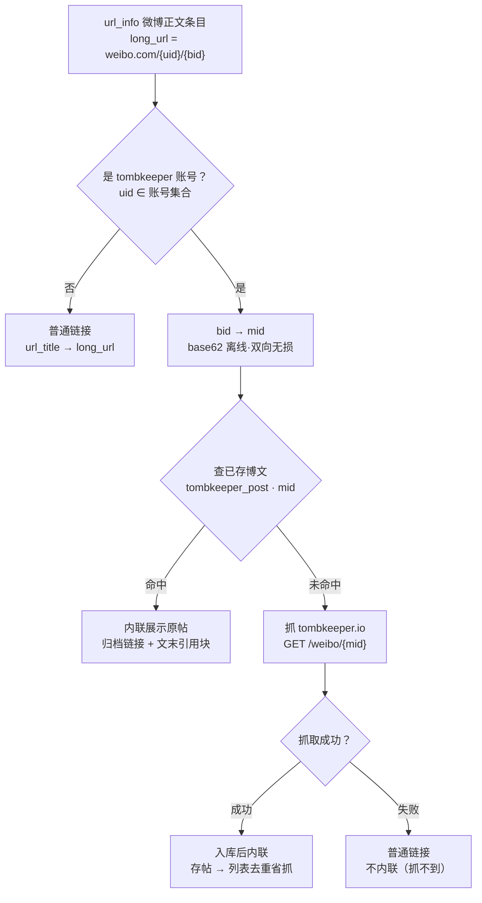

# tombkeeper 字段说明与解析规则（SSOT）

本目录是 tombkeeper 微博解析的**单一事实源（SSOT）**：微博字段语义、解析/渲染规则、以及
典型案例的原始 JSON 都以本文件为准。SPEC（[`docs/issues/2026-06-18-tombkeeper-rss.md`](../../../../docs/issues/2026-06-18-tombkeeper-rss.md)）
只描述目标/决策/数据库/接口，**解析细节不在 SPEC 重复**，以免漂移。

## 1. 数据获取与提取

- 数据源：`https://tombkeeper.io`（列表页 `/?page=N`，每页 5 条；详情页 `/weibo/{数字id}`），
  无需 cookie。
- 每条微博的结构化数据嵌在页面的 Next.js RSC flight 负载里（`self.__next_f.push([1,"…"])`）。
  **提取步骤**：① 按序拼接所有 `__next_f.push` 分片 → ② 解转义 → ③ 花括号配平抽取
  `{"id":"<数字…>", …, "retweet_id":…}` 对象（单分片内配平会因跨分片而断裂）→
  ④ 解析对象内的 flight 标记（见下）。

### flight 标记的处理

- **`$D` 日期标记**：`created_at` 形如 `"$D2026-06-22T09:47:10.000Z"`，**剥掉 `$D` 前缀**
  后按 RFC3339 解析。
- **`$ref` 引用**：如 `"url_info":"$1f"` 指向另一条 flight 行（`1f:[…]`），需**按引用解析**
  为实际数组后使用。
- **字符串 `$ref`（关键）**：长正文常被提到独立行，对象里 `"text":"$17"` 是引用而非字面量
  （Next.js 把字面量前导 `$` 编码成 `$$`，故单 `$<hex>` 必为引用）。被引用行是
  `T<hexlen>,<正文>` 格式——必须按 `<hexlen>` 字节截取正文（正文内的 `\n18:` 之类会被误判为
  行分隔符而截断）。不解析就会把正文渲染成 `$17`/`$18`。

> 目录内 `*.json` 夹具已对 `$ref` 就地解析、对 `$D` 保留前缀（便于测真实剥离），其余字段逐字保留。

## 2. 字段说明

单条微博对象的字段（实测，全集）：

| 字段                                                          | 含义/处理                                                                        |
| ------------------------------------------------------------- | -------------------------------------------------------------------------------- |
| `id`                                                          | 微博**数字 id（mid）**，如 `5311127265215757`。**全局规范主键**。                |
| `bid`                                                         | mblogid 短 id，如 `R5juh9owa`。仅作回链/排查；查找一律走 `id`（bid↔mid 见 §4）。 |
| `user_id`                                                     | 作者 uid。判定是否 tombkeeper 本人用（见 §6）。                                  |
| `screen_name`                                                 | 作者昵称。                                                                       |
| `text`                                                        | **正文纯文本（非 HTML）**：含 `\n` 换行、内联 `#话题#`/`@用户`、全角空格。       |
| `pics`                                                        | 逗号分隔图片，每项是**裸 pic id（多数，无扩展名）**或完整 sinaimg URL（少数）。  |
| `video_url`                                                   | **实测恒空**；视频实际在 `url_info`（见 §5）。                                   |
| `created_at`                                                  | 发布时间，带 `$D` 前缀（见 §1）。                                                |
| `retweet_id`                                                  | 非空=转发，值为被转发微博 `id`（见 §5 转发内联）。                               |
| `url_info`                                                    | `$ref`，解析后是数组：`t.cn` 短链展开 + 视频信息（见 §5）。                      |
| `article_url` / `topics` / `at_users` / `location` / `source` | 实测多为空，v1 不使用。                                                          |
| `attitudes_count` / `comments_count` / `reposts_count`        | 互动数，**不抽取、不入库、不展示**（仅留在 `raw`）。                             |
| `live_photo_url` / `tk_repost`                                | v1 不使用。                                                                      |

`raw`（入库字段）= 上述整个原始对象（满足「保存原始信息」）。

## 3. 解析与渲染规则（纯文本 + 结构化字段 → Markdown）

### 正文 `text`

- 转义 Markdown 特殊字符（`_` 除外——词内 `_` 非强调，且会破坏 `@user_name`）；`\n` 还原为换行。
- **`#话题#` 与 `@用户`（含 `//@用户:` 回复链）按纯文本原样渲染**，**不做斜体、不做链接化**。
  （曾用 `*…*` 斜体，但 `@`/`#` 紧跟中文时 Markdown emphasis 的 flanking 规则会让开标 `*` 失效、
  泄漏成字面星号，故移除该斜体功能。）行首孤立的 `#`/`>` 仍转义以免被当作标题/引用。

### 图片 `pics`

- **多图**：按逗号切分为**有序**列表，逐张解析→转存→在正文末尾**按原顺序**追加
  **标号内联图片** ``（N 从 1 递增，每图一行）；空段/重复 id 去重。
  （用内联 `![]` 而非纯链接 `[]`：图片在阅读器里**直接显示**，同时 `微博图片 N` 作为 alt
  文本保留图片信息，`src` 指向 OSS 缓存副本。）
- **裸 id → 可用 URL（并发探测）**：参考 [`/Users/yip/new_home/projects/image-seeker`](file:///Users/yip/new_home/projects/image-seeker)
  的做法——把裸 pic id 展开成一批候选链接（sinaimg 主机变体 `wx{1-4}`/`ww{1-4}`/`tvax{1-4}`
  的 `https://{host}.sinaimg.cn/large/{picid}.jpg`，外加第三方 CDN 代理如 baidu 图片代理 /
  `i0.wp.com` / `cdn.ipfsscan.io/weibo/`），**并发**探测可用者，取首个成功的下载。
  完整 URL 形态的条目直接下载、不再构造。下载带 `Referer: https://weibo.com`（防盗链）。
- **object key / id**：统一用裸 pic id；object key `tombkeeper/{picid}.jpg`，扩展名默认 `jpg`，
  响应 `Content-Type` 为 gif 时按实际。
- **失败=放弃但保留原链**：**所有候选 CDN 都无响应**时，标记该图为放弃
  （`tombkeeper_object.status=1`、`object_key` 留空），但正文中**保留原始图片链接**
  （``，URL 取首个候选 sinaimg 主机的 `large` 链接 / 或 `pics`
  里的完整 URL）；后续抓取遇同 id 已存在即跳过、不再重试。成功的图 `status=0`、正文链接 OSS。
- 转发原文 / 被链接帖的图片同样按此处理，归属到对应 `post_id`。

### 视频（来自 `url_info`，不是 `video_url`）

- 解析 `url_info` 数组，若有 `url_title` 含「微博视频」或 `long_url` 为
  `video.weibo.com/show?fid=…` 的项，在正文末尾追加该视频链接。
- **去重**：若该视频的 `t.cn` 短链已在正文里被展开为内联链接（即 `long_url` 已出现在正文中），
  则**不再追加**，避免同一视频出现两次（多出一行的根因）。
- `url_type` 不可靠（39 既可能是「微博视频」也可能是「查看图片」），需结合
  `url_title`/`long_url` 判定。

### `url_info` 短链处理：展开、微博正文识别与隐式引用

以 `plain_text.json` 为典型：`text` 含多个 `t.cn` 短链，`url_info` 各条带 `short_url`/`url_title`/
`url_type`/`long_url`。

**匹配**：对 `text` 里每个 `http://t.cn/xxxx`，按 `short_url` **字符串相等**回查 `url_info`
（顺序与文中无关，**不能按下标**）。

**分类与渲染**：

- **tombkeeper 微博正文**：`url_type==0` 且 `url_title=="微博正文"` 且 `long_url` 形如
  `https://weibo.com/{uid}/{bid}` 且 `uid ∈ tombkeeper 账号集合`（§6）。`bid` = `long_url`
  末段（注意 `url_info.weibo_bid` 是**当前帖**的 bid、不是目标）。
  - **行内**：把该 `t.cn` 替换为 `[微博正文N](rss_url)`，`N` 按**文中出现顺序**从 1 递增；
    `rss_url` = 我方该帖归档页（SPEC「对外接口」，URL 形态先定、handler 后做）。
  - **文末**：以引用块（`>`）内联被链接博文的正文与图片（图片转存 OSS），每条对应 `微博正文N`。
    这是**链接型隐式引用**，与 `retweet` 触发源不同但呈现类似；**只 1 层**（被内联帖里的微博
    正文链接不再递归内联）。
- **其他链接**（他人微博 / 外部网页 / 视频等）：用 `[url_title](long_url)` 替换文中 `t.cn`，
  直指原外链，不走识别/归档。

**取被链接帖内容的流程**（无检测表）：是否 tombkeeper 仅凭 `uid` 判定（无需抓取），「避免重复
抓取」由「抓到即入库 `tombkeeper_post`」保证：

> 每条链接只在其**宿主帖首次入库时处理一次**（宿主帖之后被去重跳过），故无需负缓存表。

### 转发 `retweet_id`（显式转发，区别于上面的链接型隐式引用）

- 转发帖与其被转发原文对象**在同一页 flight 负载里并存**（实测原文 9/9 同页）。解析一页时建
  `id → post` 映射，`retweet_id` 非空则就地取原文，把其 `screen_name`/`text`/图片以引用块内联
  到转发帖之后（图片转存 OSS）。
- **被转发原文 `pics` 里的图片属于原文**，按上面 §图片 渲染在**引用块内**
  （``，作为原文的一部分），**不**提到引用块之前。
- 转发者**带图转发**时附加的图片是**转发帖自己的正文图片**，**不在 `pics` 里**、而由「查看图片」
  `url_info` 携带——它要放在**引用块之前**、与原文图片区分（见下「查看图片」）。
- 原文不在同页 → 回退请求一次 `/weibo/{retweet_id}`，仍失败则只渲染转发帖自身 `text`。**只 1 层**。

### 「查看图片」（`url_type:39`）= 转发者**带图转发**的**正文图片**（不是原文图片）

- **关键更正（旧 spec 错在此处）**：转发帖里 `url_type:39`、`url_title:"查看图片"` 的 `url_info`，
  `long_url` 形如 `https://photo.weibo.com/h5/repost/reppic_id/1022:<hex>`。它指向的**不是被转发
  原文的图片**，而是**转发者本人在转发时附加的图片**（微博"带图转发"）——即这条 tombkeeper 微博
  **正文自己的图片**。被转发原文的图片在原文对象的 `pics` 里、按上面 §转发 渲染在引用块内。
  - 实例（`view_pic_retweet.json` / `weibo.com/1401527553/R5pVD1Ek5`）：正文"这个**动画片**也是
    外务省出的钱"配的**动画片**图就是「查看图片」指向的图（`53899d01…`，tombkeeper 本人图床前缀）；
    引用块里 @数字热DGHOT 原文配的是另一张**足球**图（`006mWCC…`）。两图不同、归属不同。
- **为什么 `pics` 为空**：带图转发时转发者附加的图片不写进 `pics`（实测 `pics` 空），只能经这条
  「查看图片」`url_info` 取到；其 `t.cn` 短链常出现在**正文中间**（非末尾）。
- **取真图（解析 H5 页）**：`long_url` 是 `photo.weibo.com` 的 H5 页（服务端 PHP 渲染、非
  JS-only），页面里内嵌一条 `https://wx{n}.sinaimg.cn/{size}/{picid}.jpg`。流程：① 校验
  `long_url` 主机 == `photo.weibo.com`（白名单、反 SSRF）→ ② GET 该页 → ③ 正则抽取 sinaimg URL、
  取裸 `picid` → ④ 走 §图片 的候选探测（`large` 变体）转存 OSS。（实测 `bmiddle` 与 `large` 均
  在，统一取 `large`。）
- **渲染（正文图片，放在引用块之前）**，两处协同、共用编号 N：
  - **正文内就地替换**：文中的 `t.cn`「查看图片」短链原地替换为标号链接 `[微博图片 N](OSS)`
    （链接而非 `![]` 内联，保持正文句子连贯，避免删除短链后留下断句）；
  - **引用块之前展示**：以 `` 标号内联图片放在**转发引用块之前**（直接显示）。
- **失败退化（保留原始链接，不丢弃）**：H5 抓不到 / 抽不出 sinaimg URL / 转存失败时，**不丢弃**
  该「查看图片」短链，而是把文中的 `t.cn` 就地替换为指向原始 H5 页的链接
  `[查看图片|原始链接](long_url)`（`long_url` 即 `https://photo.weibo.com/h5/repost/reppic_id/…`），
  让读者仍可点击查看；此时引用块之前**不展示图片**（无图可展）。

### 标题 `title`

- `tombkeeper_post` 有独立 `title` 列。v1 用正文**前 10 个字**填充（去换行/多余空白）。
- 后期用 **LLM 细化**标题（不在 v1 前期范围）。

### RSS item 链接与页脚

- item 的 `<link>` 指向**微博原文的 uid/bid 永久链接** `https://weibo.com/{uid}/{bid}`
  （如 `https://weibo.com/1401527553/R5pVD1Ek5`，不是 detail/mid 形式、也不是镜像站）。
- 正文 Markdown **末尾**追加一行两个链接：`[存档链接](rss_url)` 指向我方自建归档页
  （`/api/v1/archive/https://weibo.com/{uid}/{bid}`）、`[粉丝站链接](https://tombkeeper.io/weibo/{id})`
  指向 tombkeeper.io 镜像站。

## 4. mid ↔ bid 转换（base62，已验证）

数字 `id`（mid）与 `bid`（mblogid）可**双向、确定、离线、无损**转换（7/7 真实样本通过）。

- **字母表小写在前**：`0123456789abcdefghijklmnopqrstuvwxyzABCDEFGHIJKLMNOPQRSTUVWXYZ`
  （**非**大写在前，否则全错），大小写敏感。
- mid→bid：mid 十进制**从右**按 7 位分组，每组 base62 编码，**非最左组**左补零到 4 字符，拼接。
- bid→mid：**从右**按 4 字符分组，每组 base62 解码，**非最左组**左补零到 7 位，拼接。
- 链接里的 `bid` 一律先转 `id` 再用（查 DB / 抓站）。Go 实现留 PLAN 落地，用本目录夹具的
  真实 (mid,bid) 对做单测。

## 5. tombkeeper 账号集合

tombkeeper 有**两个**微博账号，均出现在 tombkeeper.io。账号数量恒定，**在 Go 服务里硬编码**
即可（后续可抽象成接口）：

| `uid`        | `screen_name` |
| ------------ | ------------- |
| `1401527553` | tombkeeper    |
| `6827625527` | t0mbkeeper    |

「是否 tombkeeper 本人」= `author_id` / 链接 `uid` 是否在该集合中。

## 6. 案例清单（夹具）

| 文件                           | 微博 id                             | 覆盖点                                                                                                                                                                                                                                                                                                   |
| ------------------------------ | ----------------------------------- | -------------------------------------------------------------------------------------------------------------------------------------------------------------------------------------------------------------------------------------------------------------------------------------------------------- |
| `single_image.json`            | 5312623991326758                    | **单图**（1 个裸 pic id）。                                                                                                                                                                                                                                                                              |
| `multi_image.json`             | 5310058709647658                    | **多图**（3 个裸 id，逗号分隔有序）。                                                                                                                                                                                                                                                                    |
| `plain_text.json`              | 5312665532239202                    | **微博正文链接**：3 个 `t.cn`，`url_info` 均 `url_title:"微博正文"`/`url_type:0`、`long_url` 指向本人微博。测 `short_url` 相等匹配、行内 `[微博正文N](rss_url)`、文末内联。                                                                                                                              |
| `retweet_with_original.json`   | 5310492706083175 → 5307458244575582 | **嵌套转发·原文同页**：`{repost, original}`，`repost.retweet_id == original.id`，渲染内联原文。                                                                                                                                                                                                          |
| `retweet_original_absent.json` | 5310369857801007 → 5307458244575582 | **嵌套转发·原文不在同页**：仅 `repost`，测回退 `/weibo/{retweet_id}`。                                                                                                                                                                                                                                   |
| `view_pic_retweet.json`        | 5312913130393333 → 5312333903562609 | **带图转发（「查看图片」）**：repost `pics` 空、`url_type:39` 查看图片携带**转发者正文图片**（经 `photo.weibo.com` H5 取真图，`53899d01…` 动画片）；原文 `pics` 是**原文图片**（`006mWCC…` 足球图）。测：查看图片短链就地换 `[微博图片 N]`、正文图片 `![…]` 放引用块**之前**、原文图片留在引用块**内**。 |
| `video.json`                   | 5310878589392289                    | **视频**：`video_url` 空，视频在 `url_info`（`url_title` 含「微博视频」、`long_url` 为 `video.weibo.com/show?fid=…`）。                                                                                                                                                                                  |

> 转发夹具用 `{"repost":…, "original":…, "_note":…}` 包装，`_note` 仅说明、非微博字段。
